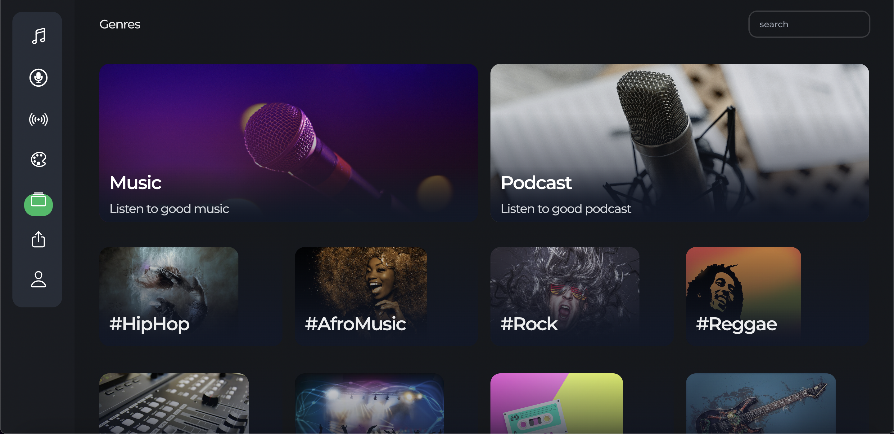

<p align="center">

</p>
<h1 align="center">🌟 Pandos 🎧 🎙️ 🌟</h1>
<p align="center">Start your project with Single Command</p>

<p align="center">
<a href="https://github.com/adidabakare/pandos/blob/master/LICENSE" title="License">

</a>
<a href="https://github.com/adidabakare/pandos/fork" title="Forks">

</a>
<a href="https://github.com/adidabakare/pandos" title="Stars">

</a>
<a href="https://img.shields.io/github/stars/adidabakare/pandos/issues" title="Issues">

</a>

</a>
</p>

<p align="center" title="Project Initiator"></p>

<h2 align="center">🌐 Links 🌐</h2>
<p align="center">
    <a href="https://youtu.be/ud4P45zhCk0" title="">🖥️ Video</a>
    .
    <a href="https://youtu.be/ud4P45zhCk0" title="">🔗 Website</a>
    ·
    <a href="https://github.com/adidabakare/pandos" title="">📂 Repo</a>
    ·
    <a href="https://github.com/adidabakare/pandos" title="🐛Report Bug/🎊Request Feature">🚀 Got Issue</a>
</p>

## 💪 Motivation

Music platforms such as Spotify and Apple Music take a large percentage of royalties from their own artists. Which we believe should not be the case. Musicians are expected to enjoy the majority of their work. Aside from that, these platforms have the censor your content anytime they want. Music, podcasts, and similar content should be owned and controlled by the user. It should not be taken over by a third party.

## 🚀 How it works

Pandos is a decentralized music, podcast and online radio platform built on IPFS that offers the ability to upload, stream and play music. The goal is to create a free decentralized version music platform which artists get paid directly through listener support.

Our application does four(4) things really well

- **Create: It allows podcast creators to record their podcasts directly from our website. And then upload them for their users to listen.**

- **Meta Space provides an intuitive user experience when it comes to creating a space for a conversation about anything. Send live reactions, tip users,and many other things.**

- **NFT:Artists can mint their album covers as NFTS and reap the benefits of both their fans purchasing the music and their NFTS.**

- **Chat: Send live messages during online space session on pandos.**

## 🦋 Prerequisite

- [Nodejs](https://nodejs.org/en// "Node") Installed

- [Git](https://git-scm.com/ "Git OFficial") Installed

- [npm](https://www.npmjs.com/ "npm ") Installed

- [Hardhat](https://hardhat.org/ "Hardhat ") Installed

## 🛠️ Installation Steps

1. Clone the repository

```Bash
git clone https://github.com/adidabakare/pandos
```

2. Change the working directory

```Bash
cd pandos
```

3. Start the local Hardhat node

```Bash
npx hardhat node
```

4. With the network running, deploy the contracts to the local network in a separate terminal window

```Bash
npx hardhat run scripts/deploy.js --network localhost
```

5. Start the app

```Bash
npm run start
```

**🎇 You are Ready to Go!**

## ⚙️ Configuration

The chain ID should be 80001. If you have a localhost rpc set up, you may need to overwrite it.

<p align="center" title="Project Initiator"></p>

To deploy to Polygon test or main networks, update the configurations located in hardhat.config.js to use a private key and, optionally, deploy to a private RPC like Infura.

```Bash
require('@nomiclabs/hardhat-waffle');
const privateKey = 'xxx';
const projectId = 'xx';

module.exports = {
  defaultNetwork: 'hardhat',
  networks: {
    hardhat: {
      chainId: 1337,
    },
    matic: {
      url: 'https://polygon-mumbai.g.alchemy.com/v2/{projectId}',
      accounts: [privateKey],
    },
  },
  solidity: {
    version: '0.8.4',
    settings: {
      optimizer: {
        enabled: true,
        runs: 200,
      },
    },
  },
};
```

## 👷 Built with

- [Solidity](https://docs.soliditylang.org/en/v0.8.17/ "Solidity"): as Main Coding Language for writing smart contract

- [ReactJs](https://reactjs.org/ "React Js"): as Main Coding Language for Creating The UI components (Front End)

- [TailwindCss](https://tailwindcss.com/ "Tailwind Css"): as Main Coding Language for styling UI components

- [IPFS](https://ipfs.tech/ "IPFS"): For Storing of files

- [Web3 Storage](https://www.google.com/search?q=web3storage "Web3 Storage"): For Storing of files

- [Moralis](https://moralis.io/ "Moralis"): as Tool for creating the chat section

- [Github](https://github.com/ "Github") : For Repo Storage and source code management

- [Git](https://git-scm.com/ "Git") : For Version Control System

## 📂 Contributing

Contributions are what make the open source community such an amazing place to learn, inspire, and create. Any contributions you make are greatly appreciated.

If you have a suggestion that would make this better, please fork the repo and create a pull request. You can also simply open an issue with the tag "enhancement". Don't forget to give the project a star! Thanks again!

- Fork the Project

- Create your Feature Branch (git checkout -b feature/AmazingFeature)

- Commit your Changes (git commit -m 'Add some AmazingFeature')

- Push to the Branch (git push origin feature/AmazingFeature)

- Open a Pull Request

## 🎊 Future Updates

- [ ] Use pandora coin to buy or rent free available premium features such as upgraded streaming quality or content exclusive channels

- [ ] Users can follow artists and receive notifications when new songs or podcasts are released.

- [ ] A live video streaming feature that allows artists to interact with their fans or followers in real time.

## 🧑🏻 Author

**Adida Baka**

- 🌌 [Profile](https://github.com/adidabakare "Adida Baka")

- 🏮 [Email](adidabakare@gmail.com "Hi!")

<h2 align="center">🤝 Support</h2>

<p align="center">🎀 Contributions (<a href="https://guides.github.com/introduction/flow" title="GitHub flow">GitHub Flow</a>), 🔥 issues, and 🥮 feature requests are most welcome!</p>

<p align="center">💙 If you like this project, Give it a ⭐ and Share it with friends!</p>

<p align="center">Made with Solidity and Javascript & ❤️ </p>
